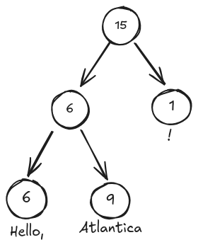

# Ropes vs Strings
Descubriendo Gleam a través del tipo de una alternativa a String

---

# io.debug(Carlos)


<div class="flex content-center h-full w-full gap-8"> 
<div class="flex flex-col justify-center h-full gap-4"> 

  - **2020:** Empiezo el grado en informática 👶🏻
  - **2023:** Descubro Elixir 🤩
  - **2024:** Graduado 🎓 en ingeniería informática en 2024
  - **2024:** Desarrollador back-end 💻 en DLTCode

  <br>
  <br>

  <div class="flex flex-col justify-center w-fit gap-2">

  <div>

  <carbon-logo-github /> [carloosaf](https://github.com/carloosaf)
  </div> 

  <div>

  <carbon-logo-linkedin /> [carloosaf](www.linkedin.com/in/carloosaf)
  </div> 

  </div> 


</div>

<div class="flex flex-col justify-center h-full">

</div>
</div>


---
backgroud: ./assets/FONDO.png
---

# Que es un rope?

<div class="grid grid-cols-2 gap-16">
  <div class="flex flex-col justify-center">

  Un `rope` es un arbol binario, con dos tipos distintos de nodos:

  - **Nodos hoja:** Contienen una cadena de caracteres y su peso (longitud).
  - **Nodos intermedios:** Solo tienen su peso, que es el tamaño de la cadena de caracteres
    de su `sup-rope` **izquierda**

  </div>

  <div>
    
  </div>
</div>


---
layout: fact
---

## Momento Gleam

<div v-click>

### Sistema de tipos de datos algebraicos

</div>


<div v-click class="flex flex-col w-full items-center justify-center mt-16">
  
</div>


---
---

# Tipo de datos Rope

<br>

- Gleam, a diferencia del resto de lenguajes de la BEAM tiene **tipado** estático.
- Sistema basado en **tipos de datos algebraicos**, como (OCaml, los enums de Rust, etc...)

<br>


```gleam {all|2-6|7|10,11}
pub type RopeNode {
  RopeNode(
    weight: Int,
    left: RopeNode,
    right: Option(RopeNode)
  )
  RopeLeaf(weight: Int, value: String)
}

pub type Rope =
  RopeNode
```

<br>

<div v-click>
  Más adelante veremos las ventajas de los tiops de datos algebraicos ✴️
  . 
</div>

---
layout: fact
---

## Muy bien... pero que aspecto tiene una función en Gleam?

---
---

# Analisis del rendimiento

<div class="flex flex-col items-center justify-center gap-8 mt-8">

  ```gleam
  pub fn insert(rope: Rope, at_index: Int, insert_value: Rope) -> Rope {
    insert_helper(rope, at_index, insert_value)
  }
  ```

  <div v-click>

  ```gleam
  fn insert_helper(node: RopeNode, index: Int, insert_value: Rope) -> RopeNode {
    case node {
      RopeNode(_weight, left, right) if index < node.weight -> {
        // [...]
      }
      RopeNode(weight, left, right) -> {
        // [...]
      }
      RopeLeaf(weight, value) -> {
        // [...]
      }
    }
  }
  ```

  Usamos `case` para evaluar el estado de nuestro árbol y valorar como continuar
  </div>
</div>

---
---

# Primera rama

<div class="flex flex-col justify-center h-full"> 

```gleam {4-7}
fn insert_helper(node: RopeNode, index: Int, insert_value: Rope) -> RopeNode {
  case node {
    // [...]
    RopeNode(_weight, left, right) if index < node.weight -> {
      let new_left = insert_helper(left, index, insert_value)
      RopeNode(length_helper(new_left, 0), new_left, right)
    }
    // [...]
  }
}
```


</div>

---
---

# Segunda rama

<div class="flex flex-col justify-center h-full">

```gleam {4-8}
fn insert_helper(node: RopeNode, index: Int, insert_value: Rope) -> RopeNode {
  case node {
    // [...]
    RopeNode(weight, left, right) -> {
      let assert Some(right_node) = right
      let new_right = insert_helper(right_node, index - weight, insert_value)
      RopeNode(weight, left, Some(new_right))
    }
    // [...]
  }
}
```

</div>


---
---

# Tercera rama

<div class="flex flex-col justify-center h-full">

  ```gleam
    RopeLeaf(weight, value) -> {
      case index {
        0 -> RopeNode(insert_value.weight, insert_value, Some(node))
        _ if index == weight -> RopeNode(node.weight, node, Some(insert_value))
        _ -> {
          let left_value = string.slice(value, 0, index)
          let right_value = string.slice(value, index, weight - index)

          let left_node =
            RopeNode(
              index,
              RopeLeaf(string.length(left_value), left_value),
              Some(insert_value),
            )

          RopeNode(
            index + insert_value.weight,
            left_node,
            Some(RopeLeaf(weight - index, right_value)),
          )
        }
      }
    }
  ```

</div>

---
layout: fact
---

## Momento Gleam

<div v-click>

### La dupla `case` y compilador

</div>

<div v-click>

El compilador analiza y muestra un error o warning siempre que nuestro
`case` no represente todos los posibles casos de nuestro estado, o si 
se gestionan de una manera que no tiene sentido.

</div>

---
---


# Ramas inaccisibles

<div class="flex flex-col gap-2">

```gleam
pub type Polygon {
  Square(side_length: Int)
  Triangle(side_a: Int, side_b: Int, side_c: Int)
}
```


<div v-click>

```gleam
pub fn perimeter(polygon: Polygon) -> Int {
  case polygon {
    Square(side_length) -> side_length * 4
    Square(side_length) -> side_length * 3 // :)
    Triangle(a, b, c) -> a + b + c
  }
}
```


</div>


<div v-click>

```ansi
warning: Unreachable case clause
   ┌─ /home/carlos/Repos/g-rope/src/gropes/rope.gleam:14:5
   │
14 │     Square(side_length) -> side_length * 3
   │     ^^^^^^^^^^^^^^^^^^^^^^^^^^^^^^^^^^^^^^

This case clause cannot be reached as a previous clause matches the same
values.

Hint: It can be safely removed.
```

</div>
</div>

---
---

## Variantes sin comprobar


<div class="flex flex-col gap-2 mt-6">

```gleam
pub fn perimeter(polygon: Polygon) -> Int {
  case polygon {
    Triangle(a, b, c) -> a + b + c
  }
}
```


<div v-click>

```ansi
error: Inexhaustive patterns
   ┌─ /home/carlos/Repos/g-rope/src/gropes/rope.gleam:12:3
   │
12 │ ╭   case polygon {
13 │ │     Triangle(a, b, c) -> a + b + c
14 │ │   }
   │ ╰───^
```
  
</div>
</div>


---
---

# Condiciones que no son completas


<div class="flex flex-col gap-2">

```gleam
pub fn perimeter(polygon: Polygon) -> Int {
  case polygon {
    Square(side_length) if side_length > 0 -> side_length * 4
    Square(side_length) if side_length < 0 -> panic
    Triangle(a, b, c) -> a + b + c
  }
}
```


<div v-click>

```ansi
error: Inexhaustive patterns
   ┌─ /home/carlos/Repos/g-rope/src/gropes/rope.gleam:12:3
   │
12 │ ╭   case polygon {
13 │ │     Square(side_length) if side_length > 0 -> side_length * 4
14 │ │     Square(side_length) if side_length < 0 -> panic
15 │ │     Triangle(a, b, c) -> a + b + c
16 │ │   }
   │ ╰───^

This case expression does not have a pattern for all possible values. If it
is run on one of the values without a pattern then it will crash.

The missing patterns are:

    Square(_)
```  

</div>

</div>


---
---

# Benchmarks


<div class="flex flex-col gap-4 justify-center">

Es hora de comprobar si el rendimiento es el prometido, en el caso de `concat`, 
la teoría nos dice que debería ser más rápido en las `ropes`, ya su complejidad
temporal es de $O(\log{n})$ vs. $O(n+m)$. <span v-click> Pero la realidad... </span>


<div v-click>

| Función | Instrucciones por segundo | Tiempo de ejecución medio | Diferencia |
| --- | --- | --- | --- |
| `string.concat` | 92.03 K | 10.87 μs |  |
| `rope.concat`|  25.78 K | 38.78 μs |  3.57x slower |

</div>


<div class="flex justify-center">

</div>

</div>

---
layout: iframe-right
url: https://flamegraph.com/share/3ba285c9-4552-11f0-b170-826a90ca3d79
---

## Benchmark de `concat`

<br>

```gleam{all|6-19|11,15}
pub fn concat_ropes_with_from_string_benchmark(
  ropes: List(ConcatBenchmarkInput),
) {
  let _result =
    list.fold(ropes, rope.from_string(""), 
    fn(acc, input) {
      case input {
        ConcatBenchmarkInput(True, string, _rope) ->
          rope.concat(
            acc,
            rope.from_string(string)
          )
        ConcatBenchmarkInput(False, string, _rope) ->
          rope.concat(
            rope.from_string(string),
            acc
          )
      }
    })
  Nil
}
```

---
layout: fact
---

## Momento Gleam

<div v-click>

### Interoperabilidad con otros lenguajes

</div>

---
---

# `@external` en Gleam

<div> 

Gleam es un lenguaje joven, me encontré con que no había ninguna librería 
nativa para realizar *flamegraphs* en Gleam.

</div> 

```gleam

pub type EflambeFormat {
  Svg
  BrendanGregg
}

pub type EflambeOptions {
  OutputFormat(EflambeFormat)
  Return(EflambeReturn)
  OutputDirectory(String)
  Open
}

@external(erlang, "eflambe", "apply")
pub fn apply(
  subject: #(fn(input_type) -> return, List(input_type)),
  list: List(EflambeOptions),
) -> void
```

---
---

# Targets gleam


<div class="flex flex-col gap-4">

`@external` nos permite llamar a funciones de 3 lenguajes:


- Erlang
- Elixir
- JavaScript

<div>
Erlang es la opción por defecto

```bash
$ gleam run --target=erlang src/main.gleam
```
</div>

<div>
Pero también podemos compilar para JavaScript

```bash
$ gleam run --target=javascript src/main.gleam
```
</div>

</div>

---
---

# Implementación de `string.length`

<div class="flex flex-col gap-2">

Gleam está implementado a partir de llamadas externas a módulos tanto de Erlang
como de JavaScript. 


```gleam
@external(erlang, "string", "length")
@external(javascript, "../gleam_stdlib.mjs", "string_length")
pub fn length(string: String) -> Int
```

```javascript
export function string_length(string) {
  if (string === "") {
    return 0;
  }
  const iterator = graphemes_iterator(string);
  if (iterator) {
    let i = 0;
    for (const _ of iterator) { i++; }
    return i;
  } else { return string.match(/./gsu).length; }
}
```

</div>

---
layout: center
---

# Muchas gracias!


